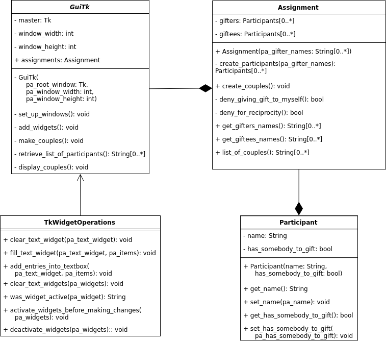

# Parovacka_python - Giftee Finder

How this project idea came up.

## How to use it

## Project structure

## UML

## Class diagram

Created with [draw.io](draw.io).

The exported XML source file with the class diagram can be found [here](resources/parovacka_class_diagram.xml). Import it into draw.io for editing.

## Algorithm

Add flowchart from "Assignment" class

## Project dependencies

The project has been build against Python 3.7.

First of all, upgrade pip:

`pip3 install --upgrade pip`

Pyperclip module is needed to support copying from disabled (Text) widget in Tk under (Arch) Linux.

`pip3 install pyperclip`

If the pip commands are failing, try to execute them using `sudo`.

## Deployment

Deployment of the application into one executable/binary file can be done by pyinstaller.

`sudo pip3 install pyinstaller`

`pyinstaller --onefile --windowed --name "Parovacka" gui/guitk.py`

## Sources:
https://stackoverflow.com/questions/42560585/how-do-i-center-text-in-the-tkinter-text-widget  
https://stackoverflow.com/questions/24644339/python-tkinter-resize-widgets-evenly-in-a-window/30908374#30908374  
https://www.tutorialspoint.com/python/tk_listbox.htm => count number of items in Listbox  
https://www.youtube.com/watch?v=FueIPFqRyyY => save content of Text widget into a variable 
https://stackoverflow.com/questions/743806/how-to-split-a-string-into-a-list  
https://stackoverflow.com/questions/976882/shuffling-a-list-of-objects  
https://stackoverflow.com/questions/2612802/how-to-clone-or-copy-a-list  
http://treyhunner.com/2016/04/how-to-loop-with-indexes-in-python/ => for loop with index  
https://stackoverflow.com/questions/1896918/running-unittest-with-typical-test-directory-structure#24266885  
https://stackoverflow.com/questions/1896918/running-unittest-with-typical-test-directory-structure#24266885  
https://gist.github.com/tasdikrahman/2bdb3fb31136a3768fac  
https://code.tutsplus.com/tutorials/write-professional-unit-tests-in-python--cms-25835  
https://stackoverflow.com/questions/36931415/using-properties-in-python-clases-cause-maximum-recursion-depth-exceeded#36931502  
http://python-textbok.readthedocs.io/en/1.0/Introduction_to_GUI_Programming.html#tkinter-basics  
https://stackoverflow.com/questions/3842155/is-there-a-way-to-make-the-tkinter-text-widget-read-only#24965264  
https://stackoverflow.com/questions/26994168/printing-a-list-to-a-tkinter-text-widget#26994242  
https://stackoverflow.com/questions/23554872/why-does-pycharm-propose-to-change-method-to-static#23555313  
https://stackoverflow.com/questions/30556857/creating-a-static-class-with-no-instances#30556886  
https://stackoverflow.com/questions/3221908/is-it-possible-to-get-widget-settings-in-tkinter#3222000  
https://www.thecodeship.com/patterns/guide-to-python-function-decorators/  
https://stackoverflow.com/questions/27966626/how-to-clear-delete-the-contents-of-a-tkinter-text-widget#27967664  
https://stackoverflow.com/questions/129507/how-do-you-test-that-a-python-function-throws-an-exception/3166985#3166985  
https://stackoverflow.com/questions/30889238/python-assertraises-dont-pass-test-if-function-with-parameters/30889475#30889475  
https://stackoverflow.com/questions/3949844/how-to-get-the-screen-size-in-tkinter/3949983#3949983  
https://stackoverflow.com/questions/6569528/python-float-to-int-conversion/6569657#6569657  
http://effbot.org/tkinterbook/grid.htm  
https://stackoverflow.com/questions/18252434/scaling-tkinter-widgets/18270468#18270468  
https://stackoverflow.com/questions/46917915/resizing-in-a-grid-manager-tkinter/46918198#46918198  
https://stackoverflow.com/questions/16650369/updating-object-properties-in-list-comprehension-way/16650466#16650466  
https://docs.python.org/2/library/copy.html  
https://stackoverflow.com/questions/176918/finding-the-index-of-an-item-given-a-list-containing-it-in-python/176921#176921  
https://stackoverflow.com/questions/3842155/is-there-a-way-to-make-the-tkinter-text-widget-read-only#45417036  
https://stackoverflow.com/questions/37383755/keyboard-shortcuts-with-tkinter-in-python-3/37383887#37383887  
https://stackoverflow.com/questions/11063458/python-script-to-copy-text-to-clipboard/11063483#11063483  
https://stackoverflow.com/questions/38111340/cant-import-pyperclip/45323641#45323641  
https://stackoverflow.com/questions/4073468/how-do-i-get-a-selected-string-in-from-a-tkinter-text-box/4073612#4073612  
https://www.reddit.com/r/learnpython/comments/8v2d74/copied_content_via_pyperclip_does_not_persist_in/  
https://www.reddit.com/r/learnpython/comments/8v2d74/copied_content_via_pyperclip_does_not_persist_in/e1lemx8/  
https://stackoverflow.com/questions/49146/how-can-i-make-an-exe-file-from-a-python-program/49155#49155  
http://www.pyinstaller.org/  
https://mborgerson.com/creating-an-executable-from-a-python-script/  
http://effbot.org/tkinterbook/label.htm  
http://effbot.org/tkinterbook/grid.htm  
https://stackoverflow.com/questions/10826738/setting-uneven-cell-heights-in-a-tkinter-gui-using-grid/10829076#10829076  
https://stackoverflow.com/questions/27459257/how-to-represent-an-attributes-data-type-as-an-array-of-objects-on-class-diagra/27459999#27459999  
https://stackoverflow.com/questions/4006868/uml-classdiagram-constructor-with-parameters/24703384#24703384  
https://stackoverflow.com/questions/46049761/how-to-present-an-abstract-class-in-uml-class-diagram/46049899#46049899 
